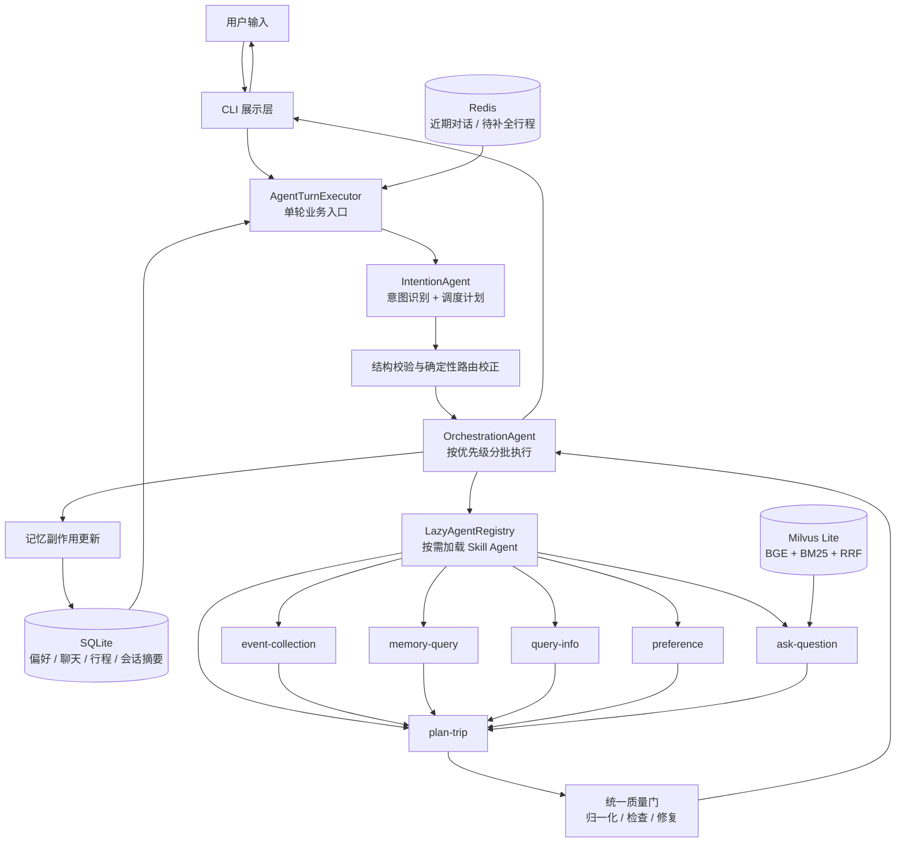
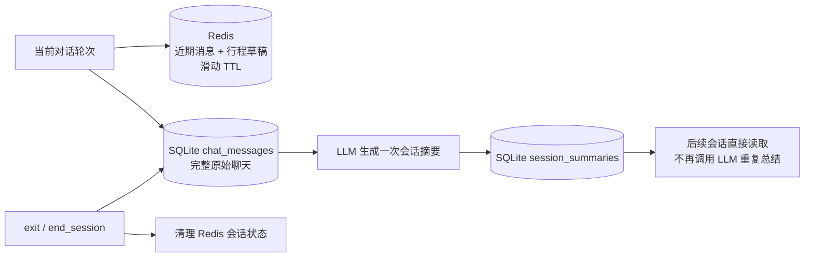

# Aligo 企业差旅助手

Aligo 是一个面向企业差旅场景的 Plan-and-Execute 多 Agent 应用。它将用户需求拆分为意图识别、信息收集、知识检索、偏好管理和行程规划等任务，再按优先级编排多个 Skill Agent。

项目重点不是单次生成一段旅行文案，而是建立一条可追踪、可测试、能跨会话保留状态的 Agent 工程链路。

> 当前形态为可本地运行的 CLI 项目，用于 AI 应用架构、评估与可靠性实践；尚未接入真实机票、酒店预订 API，不应作为无人审核的生产预订系统。

## 核心能力

| 能力 | 当前实现 |
| --- | --- |
| 多意图理解 | `IntentionAgent` 结合当前时间、历史上下文与 Skill 元数据，输出结构化调度计划 |
| Plan-and-Execute 编排 | `OrchestrationAgent` 按优先级分批；同级并行，后续批次通过 `previous_results` 使用前置结果 |
| 多轮行程补全 | 缺少出发地、目的地、日期或时长时进入追问，后续轮次合并行程草稿并恢复规划 |
| 插件化 Skill | 6 个业务 Agent 位于 `.claude/skills/`，由 `LazyAgentRegistry` 按需动态导入并缓存实例 |
| 两层记忆 | Redis 保存当前会话与待补全行程；SQLite 持久化偏好、完整聊天、历史行程和会话摘要 |
| 企业知识检索 | BGE 向量检索 + BM25 关键词检索 + RRF 排名融合，Milvus Lite 保存向量与证据元数据 |
| 行程质量门 | 模型输出经历 JSON 解析、结构归一化、确定性规则检查和最多一次统一修复 |
| 可用性保障 | 结构化输出校验、有限重试、指数退避、熔断、健康检查与单 Agent 失败隔离 |

## 系统架构



### 一次请求的执行顺序

1. `AgentTurnExecutor` 从 SQLite 读取已持久化的偏好、最近 3 个历史会话摘要与相关行程，再从 Redis 读取当前会话近期对话。
2. `IntentionAgent` 将上下文、当前时间和 Skill 能力简介组合进 Prompt，生成 `reasoning`、`intents`、`key_entities`、`rewritten_query` 和 `agent_schedule`。
3. 业务入口校验 JSON 结构，并结合 Redis 中的待补全状态做确定性路由校正。
4. `OrchestrationAgent` 按优先级分批执行：同级 Agent 通过 `asyncio.gather` 并行，不同优先级串行。
5. 行程规划结果通过统一质量门；协调器在调度结束后统一写入偏好和行程副作用，`AgentTurnExecutor` 分别记录本轮用户输入和助手结果。
6. CLI 只负责展示结构化结果，不承担核心业务逻辑。

## Skill 分工

| Skill 目录 | 调度名称 | 职责 |
| --- | --- | --- |
| `event-collection` | `event_collection` | 提取出发地、目的地、日期、时长、行程目的与预订状态 |
| `plan-trip` | `itinerary_planning` | 基于已收集的真实信息生成每日行程，并输出可校验的时间与预订引用 |
| `memory-query` | `memory_query` | 查询用户已持久化的偏好、历史行程和过往对话 |
| `preference` | `preference` | 识别偏好的类型、值以及 `append` / `replace` 更新模式 |
| `query-info` | `information_query` | 通过 wttr.in 查询天气，或通过 DDGS 搜索动态信息 |
| `ask-question` | `rag_knowledge` | 检索企业差旅规定、报销政策、预订指南和应急流程 |

`SkillLoader` 在意图识别阶段只读取 `SKILL.md` 的名称和简介；任务确定后，`LazyAgentRegistry` 才动态导入对应的 `script/agent.py` 并缓存实例，需要流程说明的 Skill Agent 再读取完整正文。这分别对应 Prompt 信息的渐进式披露和 Python 实例的懒加载。

## 记忆系统



- **Redis 短期记忆**：使用 `user_id + session_id` 隔离 key，保存最近对话和待补全行程；每次活动刷新 TTL，多个应用进程可共享会话状态。
- **SQLite 长期记忆**：使用 Repository 抽象隔离业务层和 SQL，存储用户偏好、完整聊天、幂等行程历史和会话摘要。
- **摘要生命周期**：用户输入 `exit` 时读取 SQLite 原始聊天，仅生成一次摘要。`message_count` 未变时复用已有摘要；摘要失败不会删除事实数据，也不会阻止用户退出。

## RAG 检索链路

```text
用户政策问题
→ 动态信息能力边界检查
→ BGE + Milvus 语义候选
→ BM25 关键词候选
→ RRF 融合排名
→ 分层语义阈值
→ 近重复证据过滤
→ Top-4 知识片段
→ LLM 基于证据组织回答
```

当前 RAG 开发集使用 `source + chunk_index` 标注 Gold Evidence，评价的是“是否找到正确证据”，而不是用关键词判断最终文案是否好看。

## 评估与当前结果

项目将评估分为三个独立问题，不把不同口径强行合成一个总分。

| 评估 | 固定数据集 | 当前归档结果 |
| --- | ---: | --- |
| System Evaluation | 15 个场景 × 3 次，45 次运行 | 总通过率 93.3%（42/45），Critical Pass Rate 90% |
| Itinerary Quality | 10 个场景 × 3 次，30 份行程 | 硬规则 93.3%（28/30）；28 份有效 Judge 平均分 87.93，合格率 85.7% |
| RAG Retrieval | 15 题（12 正例 + 3 负例） | Evidence Recall@4 91.67%，MRR@4 70.14%，负例拒绝率 100% |

评估边界：

- System Evaluation 检查路由、状态、调度和记忆副作用，不评价行程文案。
- Itinerary Quality 使用“确定性硬规则 + 证据约束 LLM Judge”；LLM Judge 不等于人工金标准。
- RAG 结果来自开发集，只评价证据检索，不代表最终回答准确率。

详细口径与限制见：

- [最终回归报告](evaluation/reports/final-regression-v1.0.0.md)
- [System Evaluation v0.4.0](evaluation/system/reports/v0.4.0-optimized-system-evaluation.md)
- [Itinerary Quality v0.6.0](evaluation/itinerary_quality/reports/v0.6.0-unified-quality-gate-three-run-evaluation.md)
- [RAG Retrieval v0.2.0](evaluation/rag/reports/v0.2.0-hybrid-retrieval-optimization.md)

## 快速开始

### 1. 环境要求

- Python 3.11（项目的主要开发与回归环境）
- Docker Desktop（用于本地 Redis）
- DeepSeek API Key
- 首次初始化 RAG 时需要本地 BGE 模型；配置路径不存在时会尝试从 `BAAI/bge-small-zh-v1.5` 下载

### 2. 安装依赖

```bash
python3.11 -m venv .venv
source .venv/bin/activate
python -m pip install -r requirements-dev.txt
```

`requirements-dev.txt` 包含运行依赖和测试使用的 `fakeredis`。只运行项目时可安装 `requirements.txt`。

### 3. 启动 Redis

```bash
docker compose -p travel-agent up -d redis
docker compose -p travel-agent ps
```

默认连接为 `redis://localhost:6379/0`。可通过环境变量修改：

```bash
export REDIS_URL=redis://localhost:6379/0
export REDIS_SESSION_TTL_SECONDS=3600
```

停止本地 Redis：

```bash
docker compose -p travel-agent down
```

### 4. 配置 DeepSeek

```bash
export DEEPSEEK_API_KEY="your-api-key"
```

也可以不设置环境变量；CLI 启动时会隐藏输入 API Key，密钥只保留在当前进程，不会写入仓库。

### 5. 初始化 RAG 知识库

```bash
python .claude/skills/ask-question/script/init_knowledge_base.py
```

该脚本将 8 份差旅文档切分后写入 `.claude/skills/ask-question/data/rag_knowledge/milvus_lite.db`。该数据库为本地可重建产物，不提交到 Git。

### 6. 运行 CLI

```bash
python cli.py
```

示例对话：

```text
> 帮我规划一次去北京的出差
系统：请补充出发地、出发日期和行程天数

> 下周一从苏州出发，去三天，先看参考方案
系统：合并待补全信息并继续规划
```

CLI 命令：

| 命令 | 作用 |
| --- | --- |
| `help` | 显示帮助 |
| `status` | 查看当前会话与记忆状态 |
| `health` | 探测 LLM 可用性与熔断器状态 |
| `clear` | 清理 Redis 当前任务，保留 SQLite 长期记忆 |
| `history` | 查看历史行程 |
| `preferences` | 查看已保存偏好 |
| `exit` | 生成并持久化当前会话摘要，然后退出 |

## 测试与评估

### 完整自动化回归

```bash
python -m unittest discover -s tests -p "test_*.py"
```

使用真实 Redis 服务额外验证多客户端共享：

```bash
TEST_REDIS_URL=redis://localhost:6379/0 \
python -m unittest tests.test_redis_integration -v
```

### System Evaluation

```bash
python evaluation/system/run_system_eval.py --dry-run
python evaluation/system/run_system_eval.py --runs 3
```

### Itinerary Quality Evaluation

```bash
python -m evaluation.itinerary_quality.hard_rule_evaluator

python evaluation/itinerary_quality/generate_itinerary_outputs.py \
  --runs 3 \
  --temperature 0

python evaluation/itinerary_quality/judge_itinerary_outputs.py \
  --input-report /path/to/itinerary-outputs.json \
  --temperature 0
```

### RAG Retrieval Evaluation

```bash
python evaluation/rag/run_rag_retrieval_eval.py --dry-run
python evaluation/rag/run_rag_retrieval_eval.py
```

评估的数据集、生成器、评估器、原始结果与人工归档报告的职责划分见 [evaluation/README.md](evaluation/README.md)。

## 项目结构

```text
.
├── agents/                         # 意图识别、编排和 Skill 懒加载
├── .claude/skills/                 # 6 个业务 Skill 的说明、脚本和 RAG 文档
├── context/                        # Redis 会话存储与 SQLite 长期记忆
├── services/turn_executor.py       # CLI 和评估器共用的单轮业务执行器
├── utils/                          # JSON、路由、预订上下文、质量门、重试和熔断
├── evaluation/
│   ├── system/                     # 路由、状态、调度和记忆副作用
│   ├── itinerary_quality/          # 行程硬规则与 LLM Judge
│   └── rag/                        # 证据级检索评估
├── tests/                           # 单元、组件与可选真 Redis 集成测试
├── cli.py                          # Rich CLI 入口
├── config.py                       # LLM、RAG、Redis 和可用性参数
├── compose.yaml                    # 本地 Redis
├── requirements.txt
└── requirements-dev.txt
```

## 设计取舍与已知限制

- 多 Agent 提高了模块边界、独立测试和错误定位能力，但也增加了调度、结构化输出与状态一致性成本。
- Redis 是当前正式运行依赖，连接失败不会静默降级为进程内存，避免多实例状态不一致。
- SQLite 适合单机项目与实习作品集；多节点、高并发部署时可通过 `LongTermMemoryRepository` 演进到 PostgreSQL。
- 项目没有真实票务和酒店库存。用户未提供已确认预订时，规划 Agent 只能给出参考方案，不应编造精确车次、票价、酒店价格或天气。
- RAG 当前尚未建立独立测试集和人工回答金标准；当前结果必须表述为开发集检索指标。
- 当前只提供 CLI；FastAPI / Web 入口可在不复制业务逻辑的前提下封装 `AgentTurnExecutor`。
